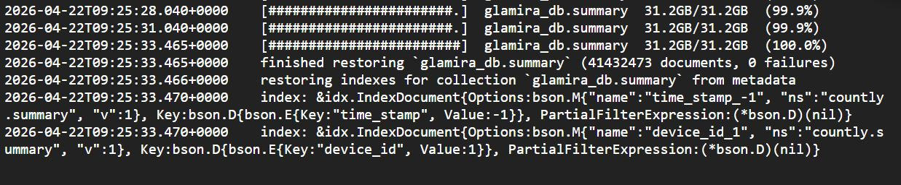

#Event Tracking Data Pipeline with GCP

## Mô tả: 
- Thực hiện thu nhập dữ liệu từ database MongoDB được cài đặt trên VM của GCP

## Các bước thực hiện:
1. Sử dụng GCS để lưu trữ file dữ liệu
2. Thiết lập VM, cài đặt MongoDB
3. Nạp data từ GCS trên mongodb database trong VM

4. Tạo file .env ngay thư mục project và tạo các biến phù hợp để kết nối tới database như sau:
- Sử dụng account với role "root" để điền thông tin `MONGO_USERNAME` và `MONGO_PASSWORD`, nếu không tạo account thì để trống.
- Sử dụng địa chỉ pulbic IP của VM để điền thông tin `MONGO_HOST`, nếu chạy trực tiếp trên VM thì để trống hoặc "localhost"
```
MONGO_USERNAME=******
MONGO_PASSWORD=******
MONGO_HOST=******
MONGO_PORT=27017
MONGO_DB_NAME=******
MONGO_COLLECTION_NAME=******
```