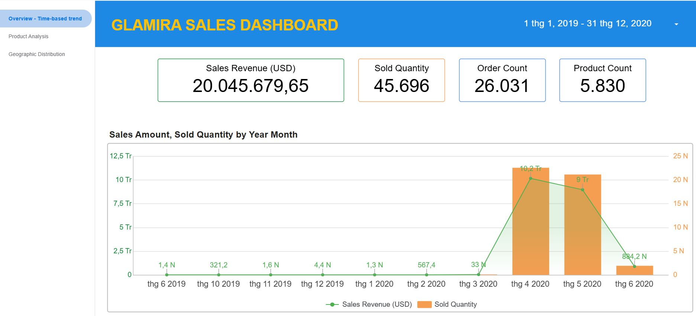
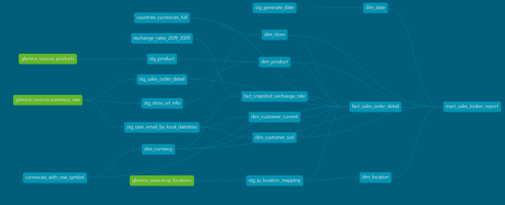
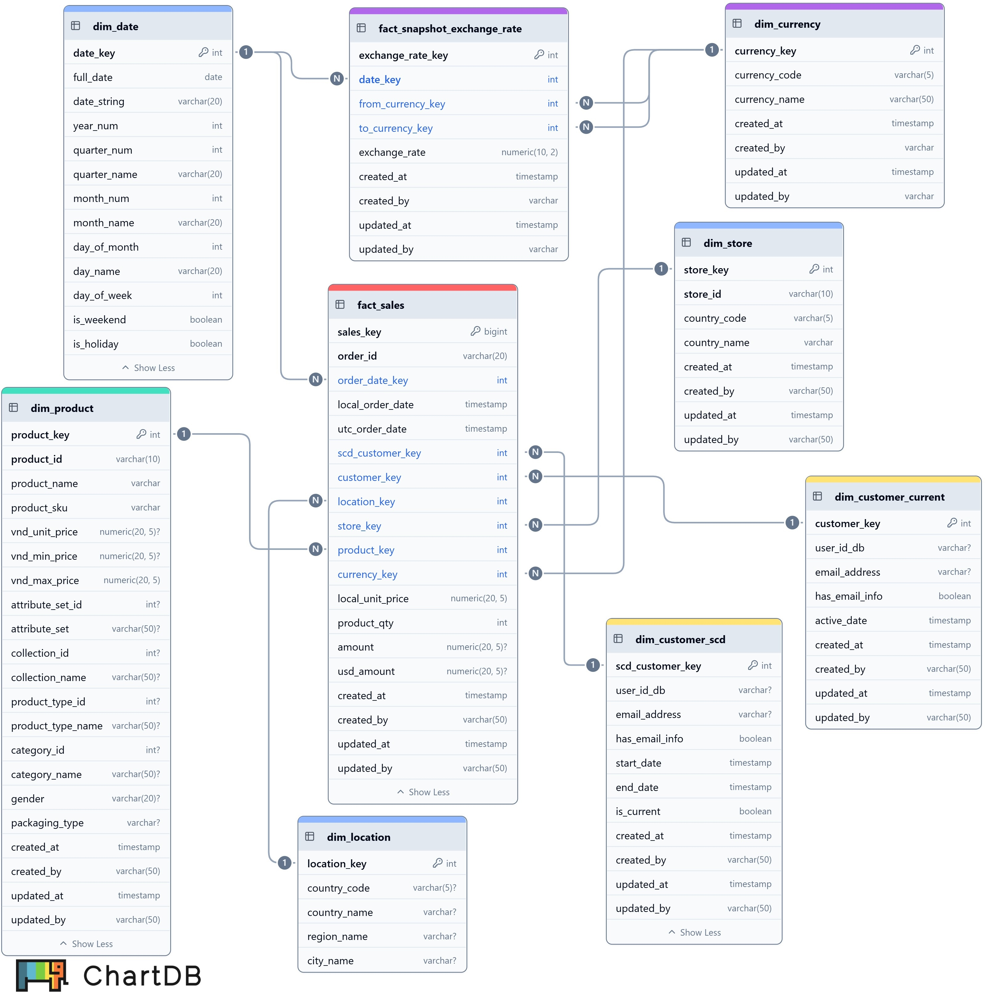

# 🚀 Event Tracking Data Pipeline with GCP: End-to-End Data Engineering Project

An end-to-end data engineering pipeline designed to ingest, process, transform, and visualize retail analytics. This project extracts raw transactional records from an operational MongoDB cluster running on a GCP virtual machine, stages them in Google Cloud Storage (GCS), transforms them using dbt (Data Build Tool) inside BigQuery to construct a robust Data Warehouse (DWH), and serves business insights via Looker Studio.

## 📊 Live Analytics Dashboard Preview
<!-- VỊ TRÍ HÌNH ẢNH 1: LOOKER DASHBOARD -->

[](https://datastudio.google.com/reporting/d8672678-82d9-4c9a-bd10-75fb68c07318)

*Figure 1: Interactive Looker Studio Dashboard displaying Revenue Analysis, Geographic Distribution, and Product Performance.*

---

## 🏗️ System Architecture & Data Flow

The platform architecture follows a modern ELT (Extract-Load-Transform) patterns:

```text
+-------------------+      Python Script      +-----------------------+
|  Operational DB   | ----------------------> | Raw Data Lake Storage |
|  (MongoDB @ GCP)  |   (Batch Ingestion)     |   (Google Cloud GCS)  |
+-------------------+                         +-----------------------+
                                                          |
                                            BigQuery Load & dbt Transform
                                                          v
+-------------------+                         +-----------------------+
|  BI Dashboard     | <---------------------- |    Data Warehouse     |
|  (Looker Studio)  |   (Analytical Models)   |  (Google BigQuery)    |
+-------------------+                         +-----------------------+
```
### 1. Ingestion & Extraction (E):
- ```src/1_ip_location_process.py``` processes raw event logs to extract IP addresses, mapping them against a local geolocational BIN database to resolve and enrich spatial metadata (country, region, city).
- ```src/2_crawl_product_data.py``` extracts unique product IDs and triggers concurrent API requests via ```src/2_crawl_data_multithread.py``` to scrape detailed product metadata using multithreading for maximum throughput.
- ```src/3_extract_data_to_GCS.py``` extracts raw event logs from MongoDB, serializes them into JSONL format, and uploads them to GCS. Subsequently, ```src/4_import_GCS_to_BigQuery.py``` ingests these staged JSONL files directly into BigQuery raw dataset.
- ```5_get_exchange_rate.py``` fetches daily exchange rates in 2019 and 2020 for all currencies via external API requests and ingests them into ```dbt seed``` for the staging layer.
 
### 2. Loading (L): 
Raw files in GCS are loaded directly into Google BigQuery external/native staging tables.

### 3. Transformation (T)
dbt acts as the core SQL processing engine inside BigQuery, structuring the Data Warehouse into a clean, multi-layered architecture:

- **Staging Layer:** Casts data types, flattens JSON fields, and renames raw columns into clear business terms.

- **Core Layer:** Implements star schema design consisting of centralized Fact tables and Dimension tables (including SCD Type 2 tracking).

- **Mart Layer:** Generates highly optimized, denormalized flat tables tailored for swift BI serving.

### 🌲 dbt Data Lineage

*Figure 2: Modular dependency graph (DAG) generated via dbt docs serve.*

### 4. Visualization (V)
Looker Studio connects directly to the optimized mart layer, utilizing custom date ranges and comparison metrics to provide frictionless business monitoring.

👉 **[Click here to explore Sales Dashboard!](https://datastudio.google.com/reporting/d8672678-82d9-4c9a-bd10-75fb68c07318)**

---
## 📦 Data Warehouse Schema Design
The transformation layer reshapes raw transactional events into a high-performance Star Schema format.

*Figure 3: Entity-Relationship Diagram (ERD) hosted on BigQuery.*


## 🛠️ Quick Start & Deployment Guide
Prerequisites
Python 3.9+ & pip installed

GCP Service Account Key with Storage Object Admin and BigQuery Admin privileges

[](https://lookerstudio.google.com/u/0/reporting/your-dashboard-id)